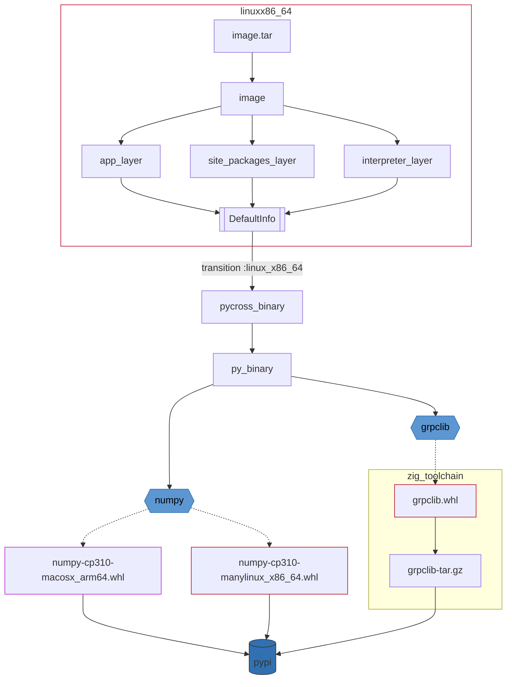

# @pycross_image

Bazel starlark rules for building container images from `py_binary` :sparkles:
using [@rules_pycross](https://github.com/jvolkman/rules_pycross) :magic:.

`@pycross_image` provides:

- `load("@pycross_image//bazel/rules:oci.bzl", "py_image")`: image rule
  compatible with [@rules_oci](https://github.com/bazel-contrib/rules_oci)
- `load("@pycross_image//bazel/rules:docker.bzl", "py_image")`: image rule
  compatible with [@rules_docker](https://github.com/bazelbuild/rules_docker)

## Installation & Usage

See [releases] page for an `http_archive` of the latest `@pycross_image`.

Examples:
- [@rules_oci example](example/oci/WORKSPACE.in).
- [@rules_docker example](example/docker/WORKSPACE.in).

A few notes about the workspace setup:

- It's divided into "steps" based on load statement dependencies.  `step1.bzl`
  only depends on things declared in `repositories.bzl`, `step2.bzl` depends on
  things declared in `step3.bzl`, etc (this pattern is from
  [tensorflow](https://github.com/tensorflow/tensorflow/tree/master/tensorflow)).
- Your workspace may already have many of the dependencies.  Some of the
  external workspace names may be differ from yours. Use the example as a study
  guide rather than canonical reference.
- The examples are only tested with the older `WORKSPACE`.  The rules may not be
  compatible with bzlmod yet.

## How it Works

In this example the `py_binary` rule has `deps` on two python wheels:
  - `numpy` has a binary wheel available from pypi for both the darwin and linux
    platforms.
  - `grpclib` only has a source distribution available.

The `pycross_binary` rule transitions from the host platform to `:linux_x86_64`.
  - the transition affects how `@rules_pycross` fetches wheels.  If the binary
    distribution is available, take it.
  - if the binary distribution is not available, compile from source using (in
    this case, with `zig` and `@hermetic_cc_toolchains`).

The image is partitioned into three tar layers by matching against filename
patterns (see rule implementation for details).

> `@rules_pycross` supports dependency fetching using PDM or poetry.
